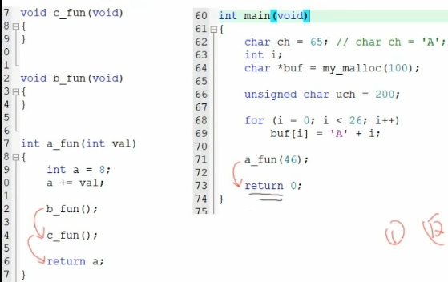
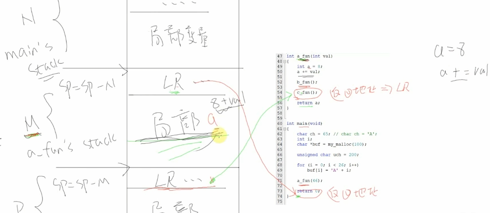
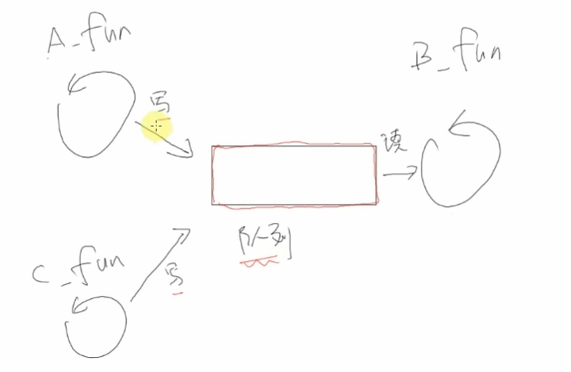
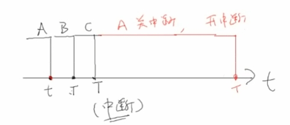
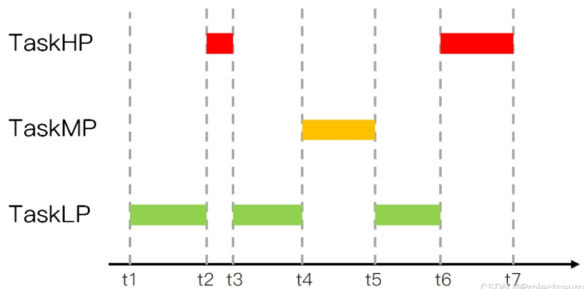
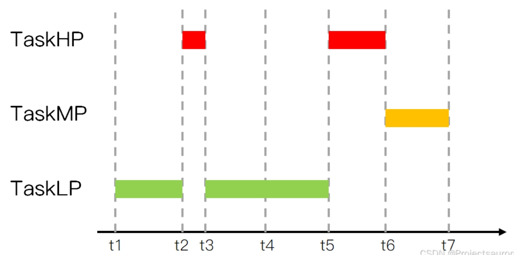

# **freeRTOS**

以上就是rtos的简单理解

## 堆栈

### 堆

与栈相比是程序员所规定划分出的一块内存

```python
char heap_buf[1024];
```

``` int* p = (int*)malloc(4);
int* p = (int*)malloc(4);
//int* 表示“指向 int 类型数据的指针 ,p 是一个变量，它保存的是“某个 int 类型数据在内存中的地址
= (int*)malloc(4); //malloc(4) 会向操作系统请求 4 个字节的连续内存空间
```

使用后需要释放内存 free(p);

```
p = (int*)calloc(4, 1);
//calloc(4, 1) 会分配 4 字节的连续内存，并且将这 4 字节初始化为 0。它与 malloc 的区别主要在于，calloc 会在分配内存后自动将其清零。
//若要分配4个int，一般会用 calloc(4, sizeof(int))
```


### 栈

与堆相比，是不被程序员所规定的



main 程序运行到a_fun(46)之前，会先将return 0的地址保存到LR（LinkRegister）中，然后调用函数a_fun(), 

同样的，进入到a_fun()中，也会调用b_fun()。在执行之前，也会保存一遍c_fun()的地址进入LR。

`那么问题来了，都保存LR，那岂不是重叠覆盖了? `    这就提到了栈的用处

再上面的基础上，会把LR存入栈中（例如即将执行a_fun()，就会先把return 0的地址存入为a_fun()所划分出的栈）如下图

**栈就是一块空闲的内存**




# 任务

## rtos的实现从代码上的理解


运行任务A到B，再回到A：任务A可能运行到一半即是“stop”就暂停了，这要求需要保存很多东西

1、执行的位置（因为要恢复执行）

2、变量的值，不能被破坏了

故，什么是任务，就是 运行中的函数

保存的就是：代码、运行位置、**运行环境**

### [函数运行的环境：](https://www.notion.so/ARM-19f059b7336d80b88891d6a0f8888a7b?pvs=21)

跳转，从底层的arm架构理解，知道cpu、ram、flash之间的关系，再了解汇编语言，知道任务切换时候，是把寄存器里的值全部保存到栈里

## 创建任务函数简析

### 任务的三个核心：

函数、栈（一块空闲的内存）、任务结构体（怎么找到这些栈）


最下面的就是TCB结构体，至少包含：fun、sp、优先级、name、参数

### 创建任务的内部细节：

栈大小取决于：1、局部变量；2、调度深度

freertos是直接取了一个17k的内存用于动态内存分配，即从一个巨大的数组里划分一个内存给某个任务用作栈


vTask1这个函数指针就是这个地址，所以要去执行这个函数就是要把这个地址赋给PC寄存器

函数的参数是放在R0里


其中这个1000就是1000*4的大小会去巨大的数组划分空间

这个空间的起始地址为下面的任务结构体的pxStack


所以创建任务实际就是刚刚说的从分配的内存里从R15（PC）往下（高位）生长，并保存寄存器

第一次创建就像是保存了一次现场。1000*4就是刚刚分配的内存（这边pxStack的位置可能不对，有可能在下面。关于高地址在上在下）


### 任务调度机制

**优先级不同：**高优先级的任务优先执行，可以抢占低优先级的任务

高优先级的不停止，低优先级的永远不执行

同等任务级的任务轮流执行：“时间片轮转”

**状态：**

运行态

就绪态

阻塞：等待某件事（时间）     本来我想去做的，但是我得等

挂起              休息去了，不是因为等

**怎么管理？**

怎么取出要运行的任务：找到最高优先级的运行态、就绪态，运行它；如果平级，轮流运行，即排队，链表前面的先运行，运行1个tick后乖乖去链表尾部排队


如图就是任务分别被放在readylist 任务1 2放在pxReadyTasksLists[0],task3放在2.于是选出可以执行的程序就很简单，从链表4开始往下找，然后找到链表2有任务，于是拿出来执行。任务2进入了5ms的延迟，进入pxDelayedTaskList，每个tick都会刷新一次链表。当task3在休息时，tick找到链表0，看到task1，执行。执行完后把他放到后面去，再执行task2，执行完也放在后面。直到task3休息完，由进入执行，如此往复循环。

关于**就序列表怎么排列**的：创建后放入的任务要是同优先级，当前任务就变为后任务（即TCB指向后任务）。要是后任务是高优先级，当前任务也变为后任务，否则还是前任务


**谁进行调度？**

tick中断 （每隔固定时间的定时器中断）在freertos就是1ms

tick中断函数就要做：1、取出下一个Task；2、切换任务（保存当前，恢复新任务）


更详细的调度：

在创建main的时候，最下面启动了调度器


在调度器里实际上创建了一个空闲任务，优先级也是0，作用主要是清理工作。例如，任务1自杀了，他的栈由空闲任务来释放


### 通过链表深入理解调度机制

```
     可抢占：高优先级的任务先运行

     时间片轮转：同优先级的任务轮流执行

     空闲任务礼让：如果有同是优先级0的就绪任务，空闲任务主动放弃一次运行机会（空闲是0）
```

ps：任何硬件中断优先级都高于rtos的优先级

### rtos任务调度机制的总体思路理解

任务1和任务2同时执行，通过tick中断实现切换任务，即（1、找出优先级最高的任务；2、去执行）

关于**找出优先级最高的任务，就要知道去哪找———-知道链表就很简单**

RTOS有三类链表，对于第一类又有很多个链表。他从上往下找并执行，并任务放在同优先级的最后。每一次tick找一次。


## 深入理解RTOS的队列及队列的实战

### 两个人任务单独执行，但是数据要交互，该怎么办

如下图，同时运行任务1和任务2，都是以同样的方式a++，但是假设在运行过程中，第一个tick，任务1执行，但是停在了读取a的值或者修改R0的值，没有完成最后一步把R0的值写入a，立马执行了任务2，两个任务都执行完最终a=1，并非理想的等于2。虽然马上又恢复现场再执行任务1


这就要求引入很多的机制，保证整个数据不被破坏

多任务访问同一个变量的时候就要**考虑互斥**的问题。如果任务1在访问变量a的时候可以互斥地访问就可以解决

这就要通过队列来实现

### 队列

#### 队列的实现与第一个好处

就上面的例子而言，那我是不是可以不让多人写。

有的xd，有的。引入一个环形缓冲区



进队列，就是进队列函数了


比如任务a，进入队列函数，如何先关闭中断，大家都不许运行了，变成好像裸机开发了，然后做完后，开中断



队列操作函数不用自己写，直接掉调用这个写队列函数就行了

#### 队列的第二个好处

休眠唤醒机制，就是下面提到的队列[阻塞访问](#阻塞访问)

当写队列的时候，除了要写数据，还要Wake up

怎么Wake up呢？就是从Queue.list中去唤醒       有两个链表：list for Receive ；list for send

是由于，比如读数据的时候发现队列是空的，那么就要要休眠，不仅仅是把自己这个任务从ReadyList移动到DelayList里，还要把自己放在Queue.list里，这样其他的任务列入写数据的时候才知道唤醒他。

消息队列**核心：关中断、链表操作、环形缓冲区**

环形缓冲区就是读写都有个指针，比如写就是下面的方法

```c 
buf[w]=val;
w=(w+1)%len
```

通过这种方式，每次到走到队尾，又会回到队头，实现**先进先出**

这就是下面提到的数据存储的核心

#### 数据储存

一个队列能保存有限数量的固定大小的数据单元。一个队列能保存单元的最大数量叫做 “长度”。每个队列数据单元的长度与大小是在创建队列时设置的。队列通常是一个先入先出（[FIFO](https://so.csdn.net/so/search?q=FIFO&spm=1001.2101.3001.7020)）的环形缓冲区

#### 传输数据的两种方法

- 拷贝：把数据、把变量的值复制进队列里
- 引用：把数据、把变量的地址复制进队列里

#### 队列的阻塞访问

<a id="阻塞访问"></a>

就比如当读取空队列，发现没数据，读写不成功，就阻塞。这其中可以指定超时时间；同样的，当队列满了，写入失败了，也会阻塞，同样可以指定超时时间。

以读取队列为例，如果队列有数据了，则该阻塞的任务会变为就绪态。**如果一直都没有数据，则时间到之后它也会进入就绪态。**

` 那么，既然已经有一种方式，即“队列有数据就进入就绪态”还需要超时时间干嘛? `

 答：避免任务长时间“死等”,系统可以做一些其他的处理方式，例如重新初始化，或者提醒开发者作排查

`那么，如果队列中有数据后，谁会优先进入就绪态呢？`  

1、优先级最高的任务

2、如果优先级一样，则等待时间最久的任务先进入就绪态

#### 队列函数：

##### 创建

分为动态分配内存、静态分配内存

动态分配内存：`xQueueCreate` 队列的内存在函数内部动态分配

```c
QueueHandle_t xQueueCreate( UBaseType_t uxQueueLength, UBaseType_t uxItemSize );
```

静态分配内存：`xQueueCreateStatic`，队列的内存要事先分配好

```c
QueueHandle_t xQueueCreateStatic(
							UBaseType_t uxQueueLength,
							UBaseType_t uxItemSize,
							uint8_t *pucQueueStorageBuffer,
							StaticQueue_t *pxQueueBuffer
						);
```

​        **复位**      队列刚被创建时，里面没有数据；使用过程中可以调用 xQueueReset() 把队列恢复为初始状态，此函数原型为：

``` c
BaseType_t xQueueReset( QueueHandle_t pxQueue);
```

##### 删除

删除队列的函数为 `vQueueDelete()` ，只能删除使用**动态方法**创建的队列，它会释放内存

``` c
void vQueueDelete( QueueHandle_t xQueue );
```

##### 写队列

可以把数据写到队列头部，也可以写到尾部。较为普遍的使用是下面的xQueueSend()   *往队列尾部写入数据*

``` c
BaseType_t xQueueSend(
				QueueHandle_t xQueue,
				const void *pvItemToQueue,
				TickType_t xTicksToWait
			);
```

另外xQueueSendToBack  xQueueSendToBackFromISR  xQueueSendToFront  xQueueSendToFrontFromISR

##### 读队列

使用 `xQueueReceive()` 函数读队列，读到一个数据后，队列中该数据会被**移除**。

```c
BaseType_t xQueueReceive( QueueHandle_t xQueue,
					void * const pvBuffer,
					TickType_t xTicksToWait );

BaseType_t xQueueReceiveFromISR(
							QueueHandle_t xQueue,
							void *pvBuffer,
							BaseType_t *pxTaskWoken
						);
```

##### 查询

可以查询队列中有多少个数据、有多少空余空间。

``` c
* 返回队列中可用数据的个数
UBaseType_t uxQueueMessagesWaiting( const QueueHandle_t xQueue );
* 返回队列中可用空间的个数
UBaseType_t uxQueueSpacesAvailable( const QueueHandle_t xQueue );
```

##### 覆盖/偷看

这与上面的读队列的方法不同，偷看的方法实现了多方数据共享，都可以读这个队列，所以读完不删除数据。

```c 
/* 覆盖队列
* xQueue: 写哪个队列
* pvItemToQueue: 数据地址
* 返回值: pdTRUE表示成功, pdFALSE表示失败
*/
BaseType_t xQueueOverwrite(
					QueueHandle_t xQueue,
					const void * pvItemToQueue
				);

BaseType_t xQueueOverwriteFromISR(
							QueueHandle_t xQueue,
							const void * pvItemToQueue,
							BaseType_t *pxHigherPriorityTaskWoken
						);
```

但是由于不删除数据，如果不做处理，就会导致队列数据阻塞，导致发送任务进入阻塞状态。

应对措施：

1、定期清理队列数据，使用receive移除已经被窥看过的数据。

2、动态调整队列长度，通过`uxQueueSpacesAvailable()`可以随时监控队列的可用空间，动态调整运行逻辑

3、限制窥视操作，可以通过逻辑控制确保窥视的频率低于数据移除的频率。

4、采用事件通知（task notification）或直接共享内存区域，不完全依赖队列的方法


接下来提到信号量和互斥量，虽然都是队列的变体，但是功能截然不同

*信号量像是一种通信的工具，用于同步*

*互斥量似乎作为一种资源的锁定，只有拿到这个令牌，才能对资源进行访问，访问完还需要归还资源*

### 信号量

特殊的队列，看可用的资源有多少，队列保护里面的val，信号量保护计数值，避免被同时调用

1、保护

2、休眠-唤醒（在处理进入和退出函数时候）

信号量分为两种**二值信号量**与**计算型信号量**，其中前者被创建时初始值为 0，后者被创建时初始值可以设定

#### 二值信号量

队列长度为1，uxMessagesWaiting只有0和1两种状态(就是队列空与队列满两种情况)

- `uxMessagesWaiting` 为 0 表示：信号量资源被获取了.
- `uxMessagesWaiting` 为 1 表示：信号量资源被释放了

所有用到了队列的阻塞机制，当队列里有值的时候，生产者并不阻塞，但是返回失败；而消费者当队列里没有值的时候就阻塞，即当`uxMessagesWaiting` 为 0 表示，任务阻塞

``` c
// 任务一
void Task1Function(void *param)
{
	volatile int i = 0;
	while (1)  {
		for (i = 0; i < 10000000; ++i) {
			sumj++;
		}
	
		// 等待 sum 计算完成释放信号量，信号量计数值 uxMessagesWaiting 加 1
		xSemaphoreGive(xSemcalc); 
		vTaskDelete(NULL);
	}
}

// 任务二
void Task2Function(void *param)
{
	while (1) {
		flagCalcEnd = 0;
		
		// 若 sum 未计算完成，则获取信号量失败，任务会进入阻塞状态，其他任务得以调度
		// 若 sum 计算完成（信号量为 1），则任务被唤醒 sum 得以打印
		xSemaphoreTake(xSemcalc, portMAX_DELAY);
		flagCalcEnd = 1;
		printf("sum = %d\r\n", sum);
	}
}
```

#### 计数信号值

二值信号量常用于同步，计数值信号量常用于事件计数、资源管理

**应用场景：**

事件计数：

每次事件发生后，在事件处理函数中释放计数型信号量（计数型信号量的资源数加 1），其他等待事件发生的任务获取计数型信号量（计数型信号量的资源数减 1），这种场景下，计数型信号量的资源数一般在创建时设置为 0。

资源管理：

计数型信号量的资源数代表着共享资源的可用数量，一个任务想要访问共享资源，就必须先获取这个共享资源的计数型信号量，之后在成功获取了计数型信号量之后，才可以对这个共享资源进行访问操作，当然，在使用完共享资源后也要释放这个共享资源的计数型信号量。在这种场合下，计数型信号量的资源数一般在创建时设置为受其管理的共享资源的**最大可用数量**。

#### 信号量函数

```c
//创建
xSemaphoreCreateBinary //二值     xSemaphoreCreateBinaryStatic
xSemaphoreCreateCounting  //计数    xSemaphoreCreateCountingStatic
//删除
void vSemaphoreDelete( SemaphoreHandle_t xSemaphore );
//give/take
xSemaphoreGive   xSemaphoreTake   //give需要释放信号量，take需要重置为0或者-去

```

### 互斥量

互斥量又称互斥信号量（本质是信号量），是一种特殊的二值信号量，它和信号量不同的是，它支持**互斥量所有权、递归访问以及防止优先级翻转**的特性，用于实现对临界资源的独占式处理。

任意时刻互斥量的状态只有两种，**开锁或闭锁**。

从过程来说，互斥锁可以被视为一个与正在共享的资源相关联的令牌，对于合法访问资源的任务，它必须首先成功 “获取” 令牌，成为资源的持有者，当持有者完成对资源的访问之后，其需要 ”归还” 令牌，只有 “归还” 令牌之后，该令牌才可以再次被其他任务所 “获取” ，这样保证了互斥的对共享资源的访问

#### 递归互斥量

*可能带来死锁现象* 例如：

任务 A 执行并成功获取互斥量 X
任务 A 被任务 B 抢占
任务 B 在尝试获取互斥量 X 之前成功获取互斥量 Y，但互斥量 X 由任务 A 持有，因此对任务 B 不可用，任务 B 选择进入阻塞状态等待互斥量 X 被释放
任务 A 继续执行，它尝试获取互斥量 Y，但互斥量 Y 由任务 B 持有，所以对于任务 A 来说是不可用的，任务 A 选择进入阻塞状态等待待释放的互斥量 Y

或者自锁 例如：

任务成功获取互斥锁

在持有互斥体的同时，任务调用库函数

库函数的实现尝试获取相同的互斥锁，并进入阻塞状态等待互斥锁变得可用

这就用到**递归互斥体**，同一任务可以多次 “获取” 递归互斥锁，并且只有在每次 “获取” 递归互斥锁之后都调用一次 “释放” 递归互斥锁，才会返回该互斥锁。一个互斥量被一个任务获取之后就不能再次获取，其他任务想要获取该互斥量必须等待这个任务释放该互斥连，但是递归互斥量可以被一个任务重复获取多次，当然每次获取必须与一次释放配对使用。

#### 优先级反转和优先级继承问题

使用二值信号量用于进程间同步时可能会出现优先级反转的问题，高优先级的反而最后执行了。举一下例子

在 t1 时刻，低优先级的任务 TaskLP 切入运行状态，并且获取到了一个二值信号量
在 t2 时刻，高优先级的任务 TaskHP 请求获取二值信号量，但是由于 TaskLP 还未释放该二值信号量，所以在 t3 时刻，任务 **TaskHP 进入阻塞状态等待二值信号量被释放**
在 t4 时刻，**中等优先级的任务 TaskMP** 进入就绪状态，由于**不需要获取二值信号量**，因此**抢占**低优先级任务任务 TaskLP 切入运行状态
在 t5 时刻，任务 TaskMP 运行结束，任务 TaskLP 再次切入运行状态
在 t6 时刻，任务 TaskLP 运行结束，释放二值信号量，此时任务 TaskHP 从等待二值信号量的阻塞状态切入运行状态
在 t7 时刻，任务 TaskHP 运行结束


但是使用**优先级继承问题**会暂时升级低优先级的优先级，让他不被抢断，而去执行

在 t1 时刻，低优先级的任务 TaskLP 切入运行状态，并且获取到了一个互斥量
在 t2 时刻，高优先级的任务 TaskHP 请求获取互斥量，但是由于 TaskLP 还未释放该互斥量，所以在 t3 时刻，任务 TaskHP 进入阻塞状态等待互斥量被释放，但是与二值信号量不同的是，此时 FreeRTOS 将任务 TaskLP 的优先级临时提高到与任务 TaskHP 一致的优先级，也即高优先级
在 t4 时刻，中等优先级的任务 TaskMP 进入就绪状态发生任务调度，但是由于任务 TaskLP 此时优先级被提高到了高优先级，因此任务 TaskMP 仍然保持就绪状态等待优先级较高的任务执行完毕
在 t5 时刻，任务 TaskLP 执行完毕释放互斥量，此时任务 TaskHP 抢占处理器切入运行状态，并恢复任务 TaskLP 原来的优先级
在 t6 时刻，任务 TaskHP 执行完毕，此时轮到任务 TaskMP 执行
在 t7 时刻，任务 TaskMP 运行结束


#### 互斥量函数

```c
//创建
SemaphoreHandle_t xSemaphoreCreateMutex(void);
SemaphoreHandle_t xSemaphoreCreateMutexStatic(StaticSemaphore_t *pxMutexBuffer);
SemaphoreHandle_t xSemaphoreCreateRecursiveMutex(void);
SemaphoreHandle_t xSemaphoreCreateRecursiveMutex(StaticSemaphore_t pxMutexBuffer);
//获取互斥量
BaseType_t xSemaphoreTake(SemaphoreHandle_t xSemaphore, TickType_t xTicksToWait);
BaseType_t xSemaphoreTakeRecursive(SemaphoreHandle_t xMutex,TickType_t xTicksToWait);
//释放互斥量
BaseType_t xSemaphoreGive(SemaphoreHandle_t xSemaphore);
BaseType_t xSemaphoreGiveRecursive(SemaphoreHandle_t xMutex);
//删除互斥量
void vSemaphoreDelete(SemaphoreHandle_t xSemaphore);
```

