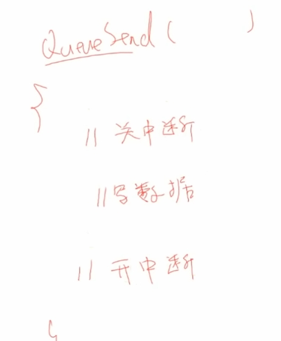
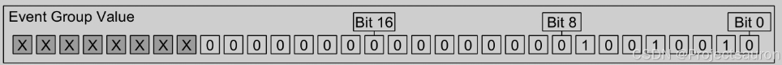
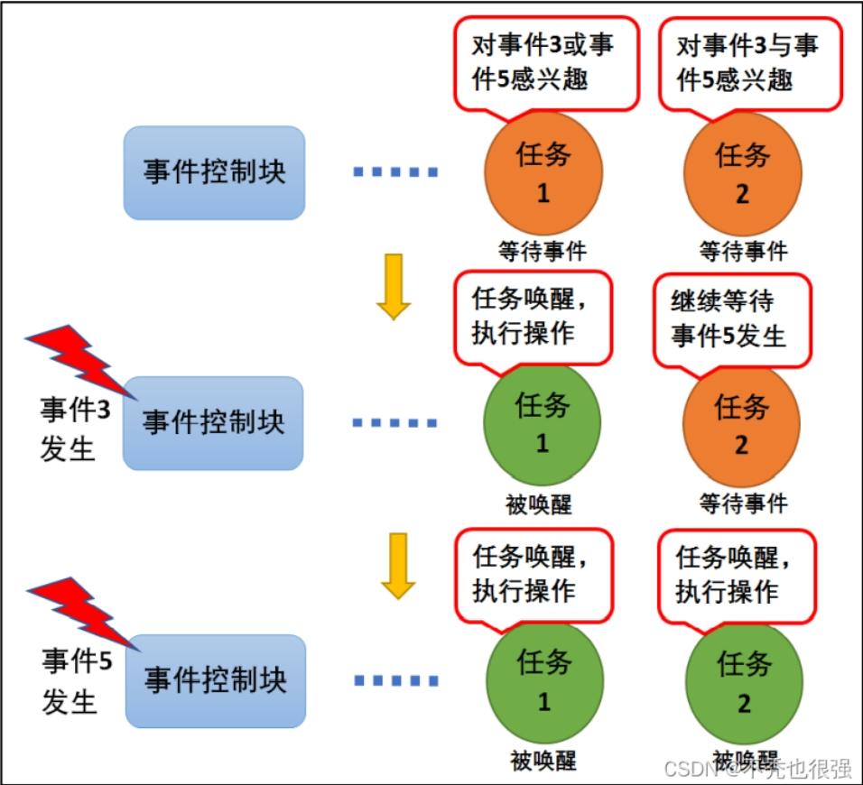
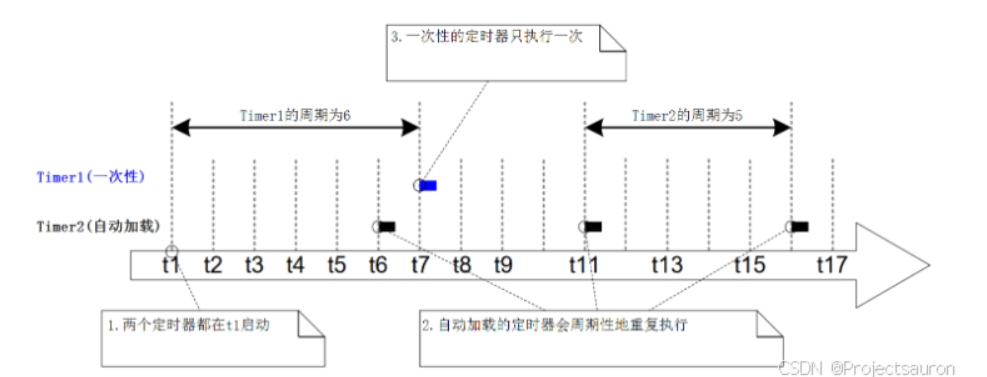
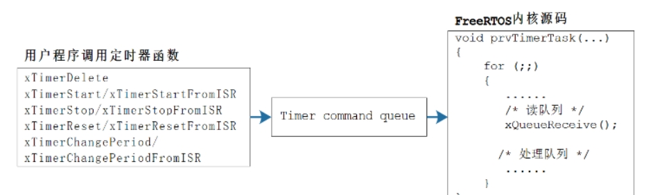

# **freeRTOS**

以上就是rtos的简单理解

## 堆栈

### 堆

与栈相比是程序员所规定划分出的一块内存

```python
char heap_buf[1024];
```

``` int* p = (int*)malloc(4);
int* p = (int*)malloc(4);
//int* 表示“指向 int 类型数据的指针 ,p 是一个变量，它保存的是“某个 int 类型数据在内存中的地址
= (int*)malloc(4); //malloc(4) 会向操作系统请求 4 个字节的连续内存空间
```

使用后需要释放内存 free(p);

```
p = (int*)calloc(4, 1);
//calloc(4, 1) 会分配 4 字节的连续内存，并且将这 4 字节初始化为 0。它与 malloc 的区别主要在于，calloc 会在分配内存后自动将其清零。
//若要分配4个int，一般会用 calloc(4, sizeof(int))
```


### 栈

与堆相比，是不被程序员所规定的


main 程序运行到a_fun(46)之前，会先将return 0的地址保存到LR（LinkRegister）中，然后调用函数a_fun(), 

同样的，进入到a_fun()中，也会调用b_fun()。在执行之前，也会保存一遍c_fun()的地址进入LR。

`那么问题来了，都保存LR，那岂不是重叠覆盖了? `    这就提到了栈的用处

再上面的基础上，会把LR存入栈中（例如即将执行a_fun()，就会先把return 0的地址存入为a_fun()所划分出的栈）如下图

**栈就是一块空闲的内存**


# 任务

## rtos的实现从代码上的理解


运行任务A到B，再回到A：任务A可能运行到一半即是“stop”就暂停了，这要求需要保存很多东西

1、执行的位置（因为要恢复执行）

2、变量的值，不能被破坏了

故，什么是任务，就是 运行中的函数

保存的就是：代码、运行位置、**运行环境**

### [函数运行的环境：](https://www.notion.so/ARM-19f059b7336d80b88891d6a0f8888a7b?pvs=21)

跳转，从底层的arm架构理解，知道cpu、ram、flash之间的关系，再了解汇编语言，知道任务切换时候，是把寄存器里的值全部保存到栈里

## 创建任务函数简析

### 任务的三个核心：

函数、栈（一块空闲的内存）、任务结构体（怎么找到这些栈）


最下面的就是TCB结构体，至少包含：fun、sp、优先级、name、参数

### 创建任务的内部细节：

栈大小取决于：1、局部变量；2、调度深度

freertos是直接取了一个17k的内存用于动态内存分配，即从一个巨大的数组里划分一个内存给某个任务用作栈


vTask1这个函数指针就是这个地址，所以要去执行这个函数就是要把这个地址赋给PC寄存器

函数的参数是放在R0里


其中这个1000就是1000*4的大小会去巨大的数组划分空间

这个空间的起始地址为下面的任务结构体的pxStack


所以创建任务实际就是刚刚说的从分配的内存里从R15（PC）往下（高位）生长，并保存寄存器

第一次创建就像是保存了一次现场。1000*4就是刚刚分配的内存（这边pxStack的位置可能不对，有可能在下面。关于高地址在上在下）


### 任务调度机制

**优先级不同：**高优先级的任务优先执行，可以抢占低优先级的任务

高优先级的不停止，低优先级的永远不执行

同等任务级的任务轮流执行：“时间片轮转”

**状态：**

运行态

就绪态

阻塞：等待某件事（时间）     本来我想去做的，但是我得等

挂起              休息去了，不是因为等

**怎么管理？**

怎么取出要运行的任务：找到最高优先级的运行态、就绪态，运行它；如果平级，轮流运行，即排队，链表前面的先运行，运行1个tick后乖乖去链表尾部排队


如图就是任务分别被放在readylist 任务1 2放在pxReadyTasksLists[0],task3放在2.于是选出可以执行的程序就很简单，从链表4开始往下找，然后找到链表2有任务，于是拿出来执行。任务2进入了5ms的延迟，进入pxDelayedTaskList，每个tick都会刷新一次链表。当task3在休息时，tick找到链表0，看到task1，执行。执行完后把他放到后面去，再执行task2，执行完也放在后面。直到task3休息完，由进入执行，如此往复循环。

关于**就序列表怎么排列**的：创建后放入的任务要是同优先级，当前任务就变为后任务（即TCB指向后任务）。要是后任务是高优先级，当前任务也变为后任务，否则还是前任务


**谁进行调度？**

tick中断 （每隔固定时间的定时器中断）在freertos就是1ms

tick中断函数就要做：1、取出下一个Task；2、切换任务（保存当前，恢复新任务）


更详细的调度：

在创建main的时候，最下面启动了调度器


在调度器里实际上创建了一个空闲任务，优先级也是0，作用主要是清理工作。例如，任务1自杀了，他的栈由空闲任务来释放


### 通过链表深入理解调度机制

```
     可抢占：高优先级的任务先运行

     时间片轮转：同优先级的任务轮流执行

     空闲任务礼让：如果有同是优先级0的就绪任务，空闲任务主动放弃一次运行机会（空闲是0）
```

ps：任何硬件中断优先级都高于rtos的优先级

### rtos任务调度机制的总体思路理解

任务1和任务2同时执行，通过tick中断实现切换任务，即（1、找出优先级最高的任务；2、去执行）

关于**找出优先级最高的任务，就要知道去哪找———-知道链表就很简单**

RTOS有三类链表，对于第一类又有很多个链表。他从上往下找并执行，并任务放在同优先级的最后。每一次tick找一次。


## 深入理解RTOS的队列及队列的实战

### 两个人任务单独执行，但是数据要交互，该怎么办

如下图，同时运行任务1和任务2，都是以同样的方式a++，但是假设在运行过程中，第一个tick，任务1执行，但是停在了读取a的值或者修改R0的值，没有完成最后一步把R0的值写入a，立马执行了任务2，两个任务都执行完最终a=1，并非理想的等于2。虽然马上又恢复现场再执行任务1


这就要求引入很多的机制，保证整个数据不被破坏

多任务访问同一个变量的时候就要**考虑互斥**的问题。如果任务1在访问变量a的时候可以互斥地访问就可以解决

这就要通过队列来实现

### 队列

#### 队列的实现与第一个好处

就上面的例子而言，那我是不是可以不让多人写。

有的xd，有的。引入一个环形缓冲区


进队列，就是进队列函数了



比如任务a，进入队列函数，如何先关闭中断，大家都不许运行了，变成好像裸机开发了，然后做完后，开中断


队列操作函数不用自己写，直接掉调用这个写队列函数就行了

#### 队列的第二个好处

休眠唤醒机制，就是下面提到的队列[阻塞访问](#阻塞访问)

当写队列的时候，除了要写数据，还要Wake up

怎么Wake up呢？就是从Queue.list中去唤醒       有两个链表：list for Receive ；list for send

是由于，比如读数据的时候发现队列是空的，那么就要要休眠，不仅仅是把自己这个任务从ReadyList移动到DelayList里，还要把自己放在Queue.list里，这样其他的任务列入写数据的时候才知道唤醒他。

消息队列**核心：关中断、链表操作、环形缓冲区**

环形缓冲区就是读写都有个指针，比如写就是下面的方法

```c 
buf[w]=val;
w=(w+1)%len
```

通过这种方式，每次到走到队尾，又会回到队头，实现**先进先出**

这就是下面提到的数据存储的核心

#### 数据储存

一个队列能保存有限数量的固定大小的数据单元。一个队列能保存单元的最大数量叫做 “长度”。每个队列数据单元的长度与大小是在创建队列时设置的。队列通常是一个先入先出（[FIFO](https://so.csdn.net/so/search?q=FIFO&spm=1001.2101.3001.7020)）的环形缓冲区

#### 传输数据的两种方法

- 拷贝：把数据、把变量的值复制进队列里
- 引用：把数据、把变量的地址复制进队列里

#### 队列的阻塞访问

<a id="阻塞访问"></a>

就比如当读取空队列，发现没数据，读写不成功，就阻塞。这其中可以指定超时时间；同样的，当队列满了，写入失败了，也会阻塞，同样可以指定超时时间。

以读取队列为例，如果队列有数据了，则该阻塞的任务会变为就绪态。**如果一直都没有数据，则时间到之后它也会进入就绪态。**

` 那么，既然已经有一种方式，即“队列有数据就进入就绪态”还需要超时时间干嘛? `

 答：避免任务长时间“死等”,系统可以做一些其他的处理方式，例如重新初始化，或者提醒开发者作排查

`那么，如果队列中有数据后，谁会优先进入就绪态呢？`  

1、优先级最高的任务

2、如果优先级一样，则等待时间最久的任务先进入就绪态

#### 队列函数：

##### 创建

分为动态分配内存、静态分配内存

动态分配内存：`xQueueCreate` 队列的内存在函数内部动态分配

```c
QueueHandle_t xQueueCreate( UBaseType_t uxQueueLength, UBaseType_t uxItemSize );
```

静态分配内存：`xQueueCreateStatic`，队列的内存要事先分配好

```c
QueueHandle_t xQueueCreateStatic(
							UBaseType_t uxQueueLength,
							UBaseType_t uxItemSize,
							uint8_t *pucQueueStorageBuffer,
							StaticQueue_t *pxQueueBuffer
						);
```

​        **复位**      队列刚被创建时，里面没有数据；使用过程中可以调用 xQueueReset() 把队列恢复为初始状态，此函数原型为：

``` c
BaseType_t xQueueReset( QueueHandle_t pxQueue);
```

##### 删除

删除队列的函数为 `vQueueDelete()` ，只能删除使用**动态方法**创建的队列，它会释放内存

``` c
void vQueueDelete( QueueHandle_t xQueue );
```

##### 写队列

可以把数据写到队列头部，也可以写到尾部。较为普遍的使用是下面的xQueueSend()   *往队列尾部写入数据*

``` c
BaseType_t xQueueSend(
				QueueHandle_t xQueue,
				const void *pvItemToQueue,
				TickType_t xTicksToWait
			);
```

另外xQueueSendToBack  xQueueSendToBackFromISR  xQueueSendToFront  xQueueSendToFrontFromISR

##### 读队列

使用 `xQueueReceive()` 函数读队列，读到一个数据后，队列中该数据会被**移除**。

```c
BaseType_t xQueueReceive( QueueHandle_t xQueue,
					void * const pvBuffer,
					TickType_t xTicksToWait );

BaseType_t xQueueReceiveFromISR(
							QueueHandle_t xQueue,
							void *pvBuffer,
							BaseType_t *pxTaskWoken
						);
```

##### 查询

可以查询队列中有多少个数据、有多少空余空间。

``` c
* 返回队列中可用数据的个数
UBaseType_t uxQueueMessagesWaiting( const QueueHandle_t xQueue );
* 返回队列中可用空间的个数
UBaseType_t uxQueueSpacesAvailable( const QueueHandle_t xQueue );
```

##### 覆盖/偷看

这与上面的读队列的方法不同，偷看的方法实现了多方数据共享，都可以读这个队列，所以读完不删除数据。

```c 
/* 覆盖队列
* xQueue: 写哪个队列
* pvItemToQueue: 数据地址
* 返回值: pdTRUE表示成功, pdFALSE表示失败
*/
BaseType_t xQueueOverwrite(
					QueueHandle_t xQueue,
					const void * pvItemToQueue
				);

BaseType_t xQueueOverwriteFromISR(
							QueueHandle_t xQueue,
							const void * pvItemToQueue,
							BaseType_t *pxHigherPriorityTaskWoken
						);
```

但是由于不删除数据，如果不做处理，就会导致队列数据阻塞，导致发送任务进入阻塞状态。

应对措施：

1、定期清理队列数据，使用receive移除已经被窥看过的数据。

2、动态调整队列长度，通过`uxQueueSpacesAvailable()`可以随时监控队列的可用空间，动态调整运行逻辑

3、限制窥视操作，可以通过逻辑控制确保窥视的频率低于数据移除的频率。

4、采用事件通知（task notification）或直接共享内存区域，不完全依赖队列的方法


接下来提到信号量和互斥量，虽然都是队列的变体，但是功能截然不同

*信号量像是一种通信的工具，用于同步*

*互斥量似乎作为一种资源的锁定，只有拿到这个令牌，才能对资源进行访问，访问完还需要归还资源*

### 信号量

特殊的队列，看可用的资源有多少，队列保护里面的val，信号量保护计数值，避免被同时调用

1、保护

2、休眠-唤醒（在处理进入和退出函数时候）

信号量分为两种**二值信号量**与**计算型信号量**，其中前者被创建时初始值为 0，后者被创建时初始值可以设定

#### 二值信号量

队列长度为1，uxMessagesWaiting只有0和1两种状态(就是队列空与队列满两种情况)

- `uxMessagesWaiting` 为 0 表示：信号量资源被获取了.
- `uxMessagesWaiting` 为 1 表示：信号量资源被释放了

所有用到了队列的阻塞机制，当队列里有值的时候，生产者并不阻塞，但是返回失败；而消费者当队列里没有值的时候就阻塞，即当`uxMessagesWaiting` 为 0 表示，任务阻塞

``` c
// 任务一
void Task1Function(void *param)
{
	volatile int i = 0;
	while (1)  {
		for (i = 0; i < 10000000; ++i) {
			sumj++;
		}
	
		// 等待 sum 计算完成释放信号量，信号量计数值 uxMessagesWaiting 加 1
		xSemaphoreGive(xSemcalc); 
		vTaskDelete(NULL);
	}
}

// 任务二
void Task2Function(void *param)
{
	while (1) {
		flagCalcEnd = 0;
		
		// 若 sum 未计算完成，则获取信号量失败，任务会进入阻塞状态，其他任务得以调度
		// 若 sum 计算完成（信号量为 1），则任务被唤醒 sum 得以打印
		xSemaphoreTake(xSemcalc, portMAX_DELAY);
		flagCalcEnd = 1;
		printf("sum = %d\r\n", sum);
	}
}
```

#### 计数信号值

二值信号量常用于同步，计数值信号量常用于事件计数、资源管理

**应用场景：**

事件计数：

每次事件发生后，在事件处理函数中释放计数型信号量（计数型信号量的资源数加 1），其他等待事件发生的任务获取计数型信号量（计数型信号量的资源数减 1），这种场景下，计数型信号量的资源数一般在创建时设置为 0。

资源管理：

计数型信号量的资源数代表着共享资源的可用数量，一个任务想要访问共享资源，就必须先获取这个共享资源的计数型信号量，之后在成功获取了计数型信号量之后，才可以对这个共享资源进行访问操作，当然，在使用完共享资源后也要释放这个共享资源的计数型信号量。在这种场合下，计数型信号量的资源数一般在创建时设置为受其管理的共享资源的**最大可用数量**。

#### 信号量函数

```c
//创建
xSemaphoreCreateBinary //二值     xSemaphoreCreateBinaryStatic
xSemaphoreCreateCounting  //计数    xSemaphoreCreateCountingStatic
//删除
void vSemaphoreDelete( SemaphoreHandle_t xSemaphore );
//give/take
xSemaphoreGive   xSemaphoreTake   //give需要释放信号量，take需要重置为0或者-去

```

### 互斥量

互斥量又称互斥信号量（本质是信号量），是一种特殊的二值信号量，它和信号量不同的是，它支持**互斥量所有权、递归访问以及防止优先级翻转**的特性，用于实现对临界资源的独占式处理。

任意时刻互斥量的状态只有两种，**开锁或闭锁**。

从过程来说，互斥锁可以被视为一个与正在共享的资源相关联的令牌，对于合法访问资源的任务，它必须首先成功 “获取” 令牌，成为资源的持有者，当持有者完成对资源的访问之后，其需要 ”归还” 令牌，只有 “归还” 令牌之后，该令牌才可以再次被其他任务所 “获取” ，这样保证了互斥的对共享资源的访问

#### 递归互斥量

*可能带来死锁现象* 例如：

任务 A 执行并成功获取互斥量 X
任务 A 被任务 B 抢占
任务 B 在尝试获取互斥量 X 之前成功获取互斥量 Y，但互斥量 X 由任务 A 持有，因此对任务 B 不可用，任务 B 选择进入阻塞状态等待互斥量 X 被释放
任务 A 继续执行，它尝试获取互斥量 Y，但互斥量 Y 由任务 B 持有，所以对于任务 A 来说是不可用的，任务 A 选择进入阻塞状态等待待释放的互斥量 Y

或者自锁 例如：

任务成功获取互斥锁

在持有互斥体的同时，任务调用库函数

库函数的实现尝试获取相同的互斥锁，并进入阻塞状态等待互斥锁变得可用

这就用到**递归互斥体**，同一任务可以多次 “获取” 递归互斥锁，并且只有在每次 “获取” 递归互斥锁之后都调用一次 “释放” 递归互斥锁，才会返回该互斥锁。一个互斥量被一个任务获取之后就不能再次获取，其他任务想要获取该互斥量必须等待这个任务释放该互斥连，但是递归互斥量可以被一个任务重复获取多次，当然每次获取必须与一次释放配对使用。

#### 优先级反转和优先级继承问题

使用二值信号量用于进程间同步时可能会出现优先级反转的问题，高优先级的反而最后执行了。举一下例子

在 t1 时刻，低优先级的任务 TaskLP 切入运行状态，并且获取到了一个二值信号量
在 t2 时刻，高优先级的任务 TaskHP 请求获取二值信号量，但是由于 TaskLP 还未释放该二值信号量，所以在 t3 时刻，任务 **TaskHP 进入阻塞状态等待二值信号量被释放**
在 t4 时刻，**中等优先级的任务 TaskMP** 进入就绪状态，由于**不需要获取二值信号量**，因此**抢占**低优先级任务任务 TaskLP 切入运行状态
在 t5 时刻，任务 TaskMP 运行结束，任务 TaskLP 再次切入运行状态
在 t6 时刻，任务 TaskLP 运行结束，释放二值信号量，此时任务 TaskHP 从等待二值信号量的阻塞状态切入运行状态
在 t7 时刻，任务 TaskHP 运行结束


但是使用**优先级继承问题**会暂时升级低优先级的优先级，让他不被抢断，而去执行

在 t1 时刻，低优先级的任务 TaskLP 切入运行状态，并且获取到了一个互斥量
在 t2 时刻，高优先级的任务 TaskHP 请求获取互斥量，但是由于 TaskLP 还未释放该互斥量，所以在 t3 时刻，任务 TaskHP 进入阻塞状态等待互斥量被释放，但是与二值信号量不同的是，此时 FreeRTOS 将任务 TaskLP 的优先级临时提高到与任务 TaskHP 一致的优先级，也即高优先级
在 t4 时刻，中等优先级的任务 TaskMP 进入就绪状态发生任务调度，但是由于任务 TaskLP 此时优先级被提高到了高优先级，因此任务 TaskMP 仍然保持就绪状态等待优先级较高的任务执行完毕
在 t5 时刻，任务 TaskLP 执行完毕释放互斥量，此时任务 TaskHP 抢占处理器切入运行状态，并恢复任务 TaskLP 原来的优先级
在 t6 时刻，任务 TaskHP 执行完毕，此时轮到任务 TaskMP 执行
在 t7 时刻，任务 TaskMP 运行结束


#### 互斥量函数

```c
//创建
SemaphoreHandle_t xSemaphoreCreateMutex(void);
SemaphoreHandle_t xSemaphoreCreateMutexStatic(StaticSemaphore_t *pxMutexBuffer);
SemaphoreHandle_t xSemaphoreCreateRecursiveMutex(void);
SemaphoreHandle_t xSemaphoreCreateRecursiveMutex(StaticSemaphore_t pxMutexBuffer);
//获取互斥量
BaseType_t xSemaphoreTake(SemaphoreHandle_t xSemaphore, TickType_t xTicksToWait);
BaseType_t xSemaphoreTakeRecursive(SemaphoreHandle_t xMutex,TickType_t xTicksToWait);
//释放互斥量
BaseType_t xSemaphoreGive(SemaphoreHandle_t xSemaphore);
BaseType_t xSemaphoreGiveRecursive(SemaphoreHandle_t xMutex);
//删除互斥量
void vSemaphoreDelete(SemaphoreHandle_t xSemaphore);
```

### 事件组

事件组可以简单地认为就是一个整数。每一位表示一个事件，每一位事件的含义由程序员决定，比如：Bit0 表示用来串口是否就绪，Bit1 表示按键是否被按下。这些位，值为 1 表示事件发生了，值为 0 表示事件没发生。

事件组用一个整数来表示，其中的高 8 位留给内核使用，只能用其他的位来表示事件。这个整数的位数由宏 `configUSE_16_BIT_TICKS` 决定：

- 如果 `configUSE_16_BIT_TICKS` 是 1，那么这个整数就是 16 位的，低 8 位用来表示事件
- 如果 `configUSE_16_BIT_TICKS` 是 0，那么这个整数就是 32 位的，低 24 位用来表示事件

例如：事件组的值为 0x92，即事件位1、4、7为1，因此仅发生由位1、4、7表示的事件，如下图：



#### 与事件组和队列、信号量的对比

唤醒谁？

- 队列、信号量：事件发生时，只会唤醒一个任务
- 事件组：事件发生时，会唤醒所有符合条件的任务，简单地说它有"广播"的作用

是否清除事件？

- 队列、信号量：是消耗型的资源，队列的数据**被读走就没了**；信号量**被获取后就减少了**
- 事件组：被唤醒的任务有两个选择，**可以让事件保留不动，也可以清除事件**

#### 事件的应用场景

事件用于事件类型的通讯，无数据传输，也就是说，我们可以用事件来做 标志位，判断某些事件是否发生了，然后根据结果做处理，那很多人又会问了，为什么我 不直接用变量做标志呢，岂不是更好更有效率？非也非也，若是在裸机编程中，用全局变 量是最为有效的方法，这点我不否认，但是在操作系统中，使用全局变量就要考虑以下问 题了：

 如何对全局变量进行保护呢，如何处理多任务同时对它进行访问？

      如何让内核对事件进行有效管理呢？使用全局变量的话，就需要在任务中轮询查 看事件是否发送，这简直就是在浪费 CPU 资源啊，还有等待超时机制，使用全局 变量的话需要用户自己去实现。

所以，在操作系统中，还是使用操作系统给我们提供的通信机制就好了，简单方便还实用。

#### 唤醒机制

事件唤醒机制，当任务因为等待某个或者多个事件发生而进入阻塞态，当事件发生的 时候会被唤醒，其过程具体见下图



#### 事件组函数

[FreeRTOS事件组 基于STM32_件 位-CSDN博客](https://blog.csdn.net/qq_61672347/article/details/125612201?spm=1001.2014.3001.5502)

包括他最后提到的事件实验例子

### 任务通知

每个任务都有 一个 32 位 的通知值，在大多数情况下，任务通知可以 替代二值信号量、计数信号量、事件组，也可以替代长度为 1 的队列（可以保存一个 32 位整数或指针值）。

相对于以前使用 `FreeRTOS` 内核通信的资源，必须创建队列、二进制信号量、计数信号量或事件组的情况，使用**任务通知显然更灵活**。

***使用前提：***想要使用任务通知，必须将 `FreeRTOSConfig.h` 中的宏定义 `configUSE_TASK_NOTIFICATIONS` 设置为 1，其实`FreeRTOS` 默认是为 1 的，所以任务通知是**默认使能**的。

#### 几种方式发送通知

- 发送通知给任务， 如果有通知未读，不覆盖通知值。
- 发送通知给任务，直接覆盖通知值。
- 发送通知给任务，设置通知值的一个或者多个位 ，可以当做事件组来使用。
- 发送通知给任务，递增通知值，可以当做计数信号量使用。

通过对以上任务通知方式的合理使用，可以在一定场合下替代 `FreeRTOS` 的信号量，队列、事件组等。

#### 任务的通知的优势

| **类别** |         **要点**         |                         **详细说明**                         |
| :------: | :----------------------: | :----------------------------------------------------------: |
| **优势** |       **效率更高**       | 直接通过任务结构体传递数据或事件，无需中间数据结构（如队列、信号量），减少上下文切换开销。 |
|          |      **更节省内存**      | 无需额外创建队列、信号量等结构体，仅利用任务自带的 `ulNotifiedValue` 字段。 |
| **限制** |  **不能发送数据给 ISR**  | ISR 没有任务结构体，无法接收任务通知；但 ISR 可发送通知给任务（如 `xTaskNotifyFromISR`）。 |
|          | **数据只能给该任务独享** |  每个任务通知只能指定一个接收任务，无法实现多任务共享数据。  |
|          |     **无法缓冲数据**     | 仅保存最新通知值，旧数据会被覆盖（类似邮箱，但无队列缓冲）。 |
|          |  **无法广播给多个任务**  |             无法一次性通知多个任务，需逐个发送。             |
|          |  **发送方无法阻塞等待**  | 若接收方未及时处理通知，发送方无法进入阻塞状态等待，需主动重试或丢弃数据。 |

就上面而言的更节省内存，每个任务本身就有一个TCB（***Task Control Block***），里面有 2 个成员：

- 一个是 uint8_t 类型，用来表示通知状态 下面提到的三种状态
- 一个是 uint32_t 类型，用来表示通知值 

```c
typedef struct tskTaskControlBlock
{
	......
	/* configTASK_NOTIFICATION_ARRAY_ENTRIES = 1 */
	volatile uint32_t ulNotifiedValue[ configTASK_NOTIFICATION_ARRAY_ENTRIES ];
	volatile uint8_t ucNotifyState[ configTASK_NOTIFICATION_ARRAY_ENTRIES ];
	......
} tskTCB;
```

#### 通知的三种取值

自上而下分别是三种状态： 

没有在等待通知、任务在等待通知、任务接收到了通知，也被称为 pending(有数据了，待处理)

``` c
#define taskNOT_WAITING_NOTIFICATION ( ( uint8_t ) 0 ) /* 也是初始状态 */
#define taskWAITING_NOTIFICATION ( ( uint8_t ) 1 )
#define taskNOTIFICATION_RECEIVED ( ( uint8_t ) 2 )
```

通知值可以有很多种类型：

- 计数值
- 位(类似事件组)
- 任意数值

#### 任务通知的使用

|          | 简化版                                     | 专业版                             |
| -------- | ------------------------------------------ | ---------------------------------- |
| 发出通知 | `xTaskNotifyGive` `vTaskNotifyGiveFromISR` | `xTaskNotify` `xTaskNotifyFromISR` |
| 取出通知 | `ulTaskNotifyTake`                         | `xTaskNotifyWait`                  |

1、简化版：xTaskNotifyGive/ulTaskNotifyTake

使用xTaskNotifyGive或vTaskNotifyGiveFromISR直接给其他任务发送通知

- 使得通知值加一
- 并使得通知状态变为"pending"，也就是 `taskNOTIFICATION_RECEIVED`，表示有数据了、待处理

使用 `ulTaskNotifyTake` 函数来取出通知值

- 如果通知值等于 0，则阻塞(可以指定超时时间)

- 当通知值大于 0 时，任务从阻塞态进入就绪态

- 在 `ulTaskNotifyTake` 返回之前，还可以做些清理工作：把通知值减一，或者把通知值清零

  ``` c
  /*
   * xTaskToNotify : 任务句柄(创建任务时得到)，给哪个任务发通知
   * 返回值 : 必定返回pdPASS
   */
  BaseType_t xTaskNotifyGive( TaskHandle_t xTaskToNotify );
  
  /*
   * xTaskHandle : 任务句柄(创建任务时得到)，给哪个任务发通知
   * pxHigherPriorityTaskWoken : 被通知的任务，可能正处于阻塞状态。此函数发出通知后，
        会把它从阻塞状态切换为就绪态。如果被唤醒的任务的优先级，高于当前任务的优先级，则 
        *pxHigherPriorityTaskWoken 被设置为pdTRUE，这表示在中断返回之前要进行任务切换。
   */
  void vTaskNotifyGiveFromISR( TaskHandle_t xTaskHandle, BaseType_t
  						*pxHigherPriorityTaskWoken );
  
  /*
   * xClearCountOnExit : 函数返回前是否清零：
   *                    pdTRUE：把通知值清零
   *                    pdFALSE：如果通知值大于0，则把通知值减一
   * xTicksToWait : 任务进入阻塞态的超时时间，它在等待通知值大于0。
   *                 0：不等待，即刻返回；
   *                 portMAX_DELAY：一直等待，直到通知值大于0；
   *                 其他值：Tick Count，可以用pdMS_TO_TICKS() 把ms转换为Tick Count
   */
  uint32_t ulTaskNotifyTake( BaseType_t xClearCountOnExit, TickType_t 
  						  xTicksToWait
  						);

2、专业版：xTaskNotify/xTaskNotifyWait

`xTaskNotify` 函数功能更强大，可以**使用不同参数实现各类功能**，比如：

- 让接收任务的通知值加一：这时 xTaskNotify() 等同于 xTaskNotifyGive()

- 设置接收任务的通知值的某一位、某些位，这就是一个轻量级的、更高效的**事件组**
- 把一个新值写入接收任务的通知值：上一次的通知值被读走后，写入才成功。这就是轻量级的、**长度为1的队列**
- 用一个新值覆盖接收任务的通知值：无论上一次的通知值是否被读走，覆盖都成功。类似 xQueueOverwrite() 函数，这就是**轻量级的邮箱**。

使用 `xTaskNotifyWait()` 函数来取出任务通知。它比 `ulTaskNotifyTake()` 更复杂：

- 可以让任务等待(可以加上超时时间)，等到任务状态为"pending"(也就是有数据)
- 还可以在函数进入、退出时，清除通知值的**指定位**

``` c
/*
 * xTaskToNotify：接收通知的任务句
 * ulValue：用于更新接收任务通知的任务通知值，具体如何更新由形参 eAction 决定
 * eAction：任务通知值更新方式，具体见下面表格
 * 返回值：参数 eAction 为 eSetValueWithoutOverwrite 时，如果被通知任务还没取走上一个通知，
 		又接收到了一个通知，则这次通知值未能更新并返回 pdFALSE，而其他情况均返回 pdPASS
 */
BaseType_t xTaskNotify( TaskHandle_t xTaskToNotify, 
						uint32_t ulValue,
						eNotifyAction eAction );

/*
 * xTaskToNotify：接收通知的任务句
 * ulValue：用于更新接收任务通知的任务通知值，具体如何更新由形参 eAction
 * eAction：任务通知值更新方式，具体见下面表格
 * pxHigherPriorityTaskWoken：在使用之前必须先初始化为 pdFALSE。当调用该函数发送一个任务通知时，
   		目标任务接收到通知后将从阻塞态变为就绪态，并且如果其优先级比当前运行的任务的优先级高，
   		那么 *pxHigherPriorityTaskWoken 会被设置为 pdTRUE，然后在中断退出前执行一次上下文切换，
   		去执行刚刚被唤醒的中断优先级较高的任务。pxHigherPriorityTaskWoken 是一个可选的参数可以设置为 NULL
 * 返回值：参数 eAction 为 eSetValueWithoutOverwrite 时，如果被通知任务还没取走上一个通知，
 		又接收到了一个通知，则这次通知值未能更新并返回 pdFALSE，而其他情况均返回 pdPASS
 */
BaseType_t xTaskNotifyFromISR( TaskHandle_t xTaskToNotify,
						        uint32_t ulValue,
								eNotifyAction eAction,
								BaseType_t *pxHigherPriorityTaskWoken );

/*
 * ulBitsToClearOnEntry：ulBitsToClearOnEntry 表示在使用通知之前，将任务通知值的哪些位清 0，
 		实现过程就是将任务的通知值与参数 ulBitsToClearOnEntry 的按位取反值按位与操作。
 		如果 ulBitsToClearOnEntry 设置为 0x01，那么在函数进入前，任务通知值的位1会被清0，其他位保持不变。
 		如果 ulBitsToClearOnEntry 设置为 0xFFFFFFFF (ULONG_MAX)，那么在进入函数前任务通知值的所有位都
 		会被清 0，表示清零任务通知值
 * pulNotificationValue：用于保存接收到的任务通知值。如果接收到的任务通知不需要使用，则设置为 NULL 即可。
 		这个通知值在参数 ulBitsToClearOnExit 起作用前将通知值拷贝到 *pulNotificationValue 中
 * xTicksToWait：等待超时时间，单位为系统节拍周期。宏 pdMS_TO_TICKS 用于将单位毫秒转化为系统节拍数
 * 返回值：如果获取任务通知成功则返回 pdTRUE，失败则返回 pdFALSE
 */
BaseType_t xTaskNotifyWait( uint32_t ulBitsToClearOnEntry,
							uint32_t ulBitsToClearOnExit,
							uint32_t *pulNotificationValue,
							TickType_t xTicksToWait );
```

其中 `eAcrtion` 的取值有多种

3、另外还有个xTaskNotifyAndQuery，与 `xTaskNotify()` 很像，都是调用通用的任务通知发送函数 `xTaskGenericNotify()` 来实现通知的发送，不同的是多了一个附加的参数 `pulPreviousNotifyValue` 用于回传接收任务的上一个通知值。

### 软件定时器

指定时间：启动定时器和运行回调函数，两者的间隔被称为定时器的周期（***period***）。

指定类型，定时器有两种类型：指定要做什么事，就是指定回调函数

- 一次性（***One-shot timers***）：
  这类定时器启动后，它的回调函数只会被调用一次；
  可以手工再次启动它，但是不会自动启动它。
- 自动加载定时器（***Auto-reload timers***）：
  这类定时器启动后，时间到之后它会自动启动它；
  这使得回调函数被周期性地调用。

指定要做什么事，就是指定回调函数

状态：运行***Running***     冬眠***Dormant***

定时器运行情况示例如下：

Timer1：它是一次性的定时器，在 t1 启动，周期是 6 个Tick。经过 6 个 tick 后，在 t7 执行回调函数。它的回调函数只会被执行一次，然后该定时器进入冬眠状态。
Timer2：它是自动加载的定时器，在 t1 启动，周期是 5 个 Tick。每经过 5 个 tick 它的回调函数都被执行，比如在 t6、t11、t16 都会执行。


```c
//在 FreeRTOS 的配置上，如果要是用定时器就需要配置下面几个宏定义：
//打开定时器
#define configUSE_TIMERS                1

//定时器的优先级
#define configTIMER_TASK_PRIORITY       50

//定时器栈大小
#define configTIMER_TASK_STACK_DEPTH    50

//定时器队列大小
#define configTIMER_QUEUE_LENGTH        50
```

#### 守护任务

软件定时器基于 Tick 来运行。但是，**在哪里执行定时器函数**呢？

在某个任务里执行，这个任务就是：`RTOS Damemon Task`，`RTOS` 守护任务。以前被称为"Timer server"，但是这个任务要做并不仅仅是定时器相关，所以改名为：`RTOS Damemon Task`。

当 `FreeRTOS` 的配置项 `configUSE_TIMERS` 被设置为 1 时，在启动调度器时，会自动创建 **`RTOS Damemon Task`。**

故自己编写的任务函数要使用定时器时，是通过"定时器命令队列"（***timer command queue***）和守护任务交互



守护任务的**调度，跟普通的任务并无差别**。当守护任务是当前优先级最高的就绪态任务时，它就可以运行。它的工作有两类：

- 处理命令：从命令队列里取出命令、处理
- 执行定时器的回调函数

#### 回调函数

``` c
void ATimerCallback( TimerHandle_t xTimer );
```

定时器的回调函数不要影响其他人：

- 回调函数要尽快实行，不能进入阻塞状态
- 不要调用会导致阻塞的API函数，比如 `vTaskDelay()`
- 可以调用 `xQueueReceive()` 之类的函数，但是超时时间要设为 0：即刻返回，不可阻塞

#### 软件定时器定时器的控制块

```c
    typedef struct tmrTimerControl                  /* The old naming convention is used to prevent breaking kernel aware debuggers. */
    {
        const char * pcTimerName;                   /*<< Text name.  This is not used by the kernel, it is included simply to make debugging easier. */ /*lint !e971 Unqualified char types are allowed for strings and single characters only. */
        ListItem_t xTimerListItem;                  /*<< Standard linked list item as used by all kernel features for event management. */
        TickType_t xTimerPeriodInTicks;             /*<< How quickly and often the timer expires. */
        void * pvTimerID;                           /*<< An ID to identify the timer.  This allows the timer to be identified when the same callback is used for multiple timers. */
        TimerCallbackFunction_t pxCallbackFunction; /*<< The function that will be called when the timer expires. */
        #if ( configUSE_TRACE_FACILITY == 1 )
            UBaseType_t uxTimerNumber;              /*<< An ID assigned by trace tools such as FreeRTOS+Trace */
        #endif
        uint8_t ucStatus;                           /*<< Holds bits to say if the timer was statically allocated or not, and if it is active or not. */
    } xTIMER;
typedef xTIMER Timer_t
```

#### 软件定时器的函数

到这里为止，个人认为主要重要的是队列，和任务通知机制，互斥量

队列可以作为传输数据的高效手段，让也数据不丢失

任务通知机制实际可以完成上面的信息量、事件组工作

但是软件定时器似乎作用不算太大，至少我用不着


做一个注释，应该在机器人需要的位置作为机械0点吗？因为反方向就是65556.会导致他转到另外一个方向

最好是竖着的时候，我定义0点


写最优旋转方向，防止机器人抽风

从代码测试值
